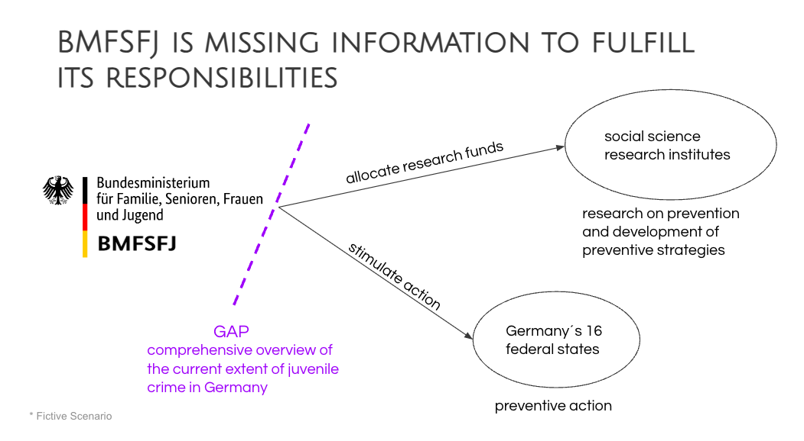

## Juvenile_crime_in_Germany
This repository shows our ([Johanna Köpke](https://www.linkedin.com/in/johanna-koepke/), [Julie Laur](https://www.linkedin.com/in/julie-laur-a4167713a/), [Alexander Schuppe](https://www.linkedin.com/in/alexander-schuppe/)) final project of the Advanced Data Analytics Bootcamp at neuefische GmbH:  
# Juvenile crime in Germany - current extent, distribution, and development
In this README file, you find an introduction to the topic and a description on the fictitious scenario that we assumed as our assigned task. Furthermore, you find a description of the scope, the sources, the process and deliverables, and the tools we used.  

If you would like to see our final delivery directly, click on the following link: https://crime-germany.streamlit.app/.  It redirects you to our dashboard that provides at-a-glance views on the current extent, distribution, and recent development of juvenile crime in Germany and its 16 federal states. 

This repository provides in several jupyter notebooks the code we used to gather, clean, and prepare the data for our dashboard. Furthermore, you find the slides of the final presentation, which was held on the 21st of August 2023. 

The code that runs the dashboard can be viewed in a separate repository: https://github.com/alexmahesh/Crime_GER

## What is juvenile crime?
In Germany, offences committed by persons aged between 14 and 20 are classified as juvenile crime. That means juvenile crime not only includes offences by juveniles (persons aged 14 to under 18), but also offences commited by adolescents (persons aged 18 to under 21).

## Who acts on prevention of juvenile crime?
While the implementation competence of preventive action against juvenile crime lies with the 16 federal states of Germany, the research on prevention and the development of preventive strategies is taken over by social science research institutes. Germany is involved in this process in the role of the Bundesministerium für Familie, Senioren, Frauen und Jugend. The BMFSFJ is responsible for stimulating action in the 16 federal states and for allocating funds on research.
(Sources: [BMFSFJ](https://www.bmfsfj.de/bmfsfj/themen/kinder-und-jugend/integration-und-chancen-fuer-junge-menschen/kriminalitaets-und-gewaltpraevention/kriminalitaets-und-gewaltpraevention-bei-kindern-und-jugendlichen-86212) and [Deutsches Jugeninstitut e.V. (DJI)](https://www.bmfsfj.de/bmfsfj/ministerium/ressortforschung))

## Scenario (Fictive)
In order to be able to optimally fulfill its competences to stimulate adequate action and to distribute funds appropriately, the BMFSFJ assigned us to provide them with a comprehensive overview of the current extent of juvenile crime in Germany.

They would like to know the current level of juvenile crime, the development over the recent years, the offenses that account for the majority of juvenile crime, and the distribution of the most common offenses.

---
### Scope

* Time frame: last five years (2018 - 2022)
* Area: Germany and its 16 federal states
* Age groups:
    * 14 < 16
    * 16 < 18
    * 18 < 21
* Selected crimes:  
---
|BKA Schluessel|Crime German|Crime English|
---|---|---|
|------|Straftaten insgesamt|Total offences|
|100000|Straftaten gegen die sexuelle Selbstbestimmung insgesamt|Sexual offences|
|210000|Raub, räuberische Erpressung und räuberischer Angriff auf Kraftfahrer §§ 249-252, 255, 316a StGB|Robbery|
|220000|Körperverletzung §§ 223-227, 229, 231 StGB|Assault|
|232100|Freiheitsberaubung § 239 StGB|Deprivation of liberty|
|232200|Nötigung § 240 StGB|Coercion|
|435*00|Wohnungseinbruchdiebstahl §§ 244 Abs. 1 Nr. 3 und Abs. 4, 244a StGB|Residential burglary|
|*26*00|Ladendiebstahl insgesamt|Shoplifting|
|674000|Sachbeschädigung §§ 303-305a StGB|Damage to property|
|730000|Rauschgiftdelikte (soweit nicht bereits mit anderer Schlüsselzahl erfasst)|Drug offences (w/o procurement)|
|891100|direkte Beschaffungskriminalität|Drug procurement crime|
|010000, 020010|Mord § 211 StGB, Totschlag § 212 StGB|Homicide|

## Data Sources

* [Police crime statistics: PKS Bundeskriminalamt, 2018 - 2022, Version 2.0](https://www.bka.de/DE/AktuelleInformationen/StatistikenLagebilder/PolizeilicheKriminalstatistik/pks_node.html)

* [German federal statistical office (Statistisches Bundesamt - Destatis)](https://www-genesis.destatis.de/genesis/online?sequenz=statistikTabellen&selectionname=12411#abreadcrumb) 

The tables from the German federal criminal police office (BKA) provide the numbers of supsects in absolute numbers. Additionally, relative numbers were calculated on the basis of the population figures in the respective age groups provided by the German federal statistical office. The population figures of 31 December of the respective previous year (reporting date) were used.

## Process and deliverables
Our development process started with importing the data from the BKA and Destatis into DataFrames to explore them further. After cleaning, merging and concatenating the tables, we stored them in a PostgreSQL database (Microsoft Azure). We then performed an initial EDA using Python, specifically Pandas and Plotly. Then we created the final DataFrames we wanted to use in the dashboard and stored them in our database as well. Finally, we created a dashboard using Streamlit. 

In order to get an overview of the current extent, distribution and recent development of juvenile crime, we decided to develop a dashboard. The dashboard can be used to look at Germany in general and the 16 federal states individually. It is also possible to look by age groups or different types of offences. In addition, all offender figures can be displayed in the dashboard both in absolute and relative terms.
In our presentation, we chose Hamburg as an example for one of the 16 federal states to show insights generated with the dashboard.

## Tools and technologies

