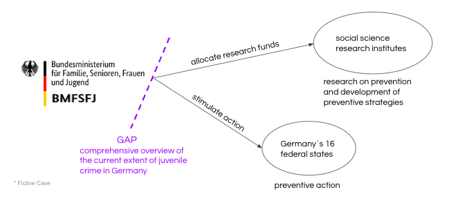

# Juvenile_crime_in_Germany
This repository shows our final project of the Advanced Data Analytics Bootcamp at neuefische GmbH:  
## Juvenile crime in Germany - current extent, distribution, and development

### Scenario (Fictive)
While the implementation competence of preventive action against juvenile crime lies with the 16 federal states of Germany, the research on prevention and the development of preventive strategies is taken over by social science research institutes. Germany is involved in this process in the role of the Bundesministerium für Familie, Senioren, Frauen und Jugend. The BMFSFJ is responsible for stimulating action in the 16 federal states and for allocating funds on research.  

In order to be able to optimally fulfill its competences to stimulate adequate action and to distribute funds appropriately, the BMFSFJ assigned us to provide them with a comprehensive overview of the current extent of juvenile crime in Germany.

They would like to know the current level of juvenile crime, the development over the recent years, the offenses that account for the majority of juvenile crime, and the distribution of the most common offenses.

### Scope
Time Frime: last five years (2018 - 2022)
Area: Germany and its 16 federal states
Age groups:
* 14 < 16
* 16 < 18
* 18 < 21
* Selected Crimes:  
| BKA Schluessel | Crime German	| Crime English |
| ------	| Straftaten insgesamt	| Total offences
| 100000	| Straftaten gegen die sexuelle Selbstbestimmung insgesamt	| Sexual offences
| 210000	| Raub, räuberische Erpressung und räuberischer Angriff auf Kraftfahrer §§ 249-252, 255, 316a StGB	| Robbery
| 220000	| Körperverletzung §§ 223-227, 229, 231 StGB	| Assault
| 232100	| Freiheitsberaubung § 239 StGB	| Deprivation of liberty
| 232200	| Nötigung § 240 StGB	| Coercion
| 435*00	| Wohnungseinbruchdiebstahl §§ 244 Abs. 1 Nr. 3 und Abs. 4, 244a StGB	| Residential burglary
| 2600	| Ladendiebstahl insgesamt	| Shoplifting
| 674000	| Sachbeschädigung §§ 303-305a StGB	| Damage to property
| 730000	| Rauschgiftdelikte (soweit nicht bereits mit anderer Schlüsselzahl erfasst)	| Drug offences (w/o procurement)
| 891100	| direkte Beschaffungskriminalität	| Drug procurement crime
| 010000, 020010	| Mord § 211 StGB, Totschlag § 212 StGB	| Homicide

### Data Sources

+6*
